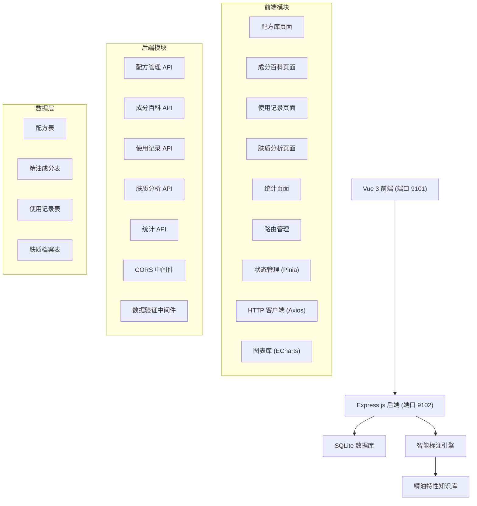
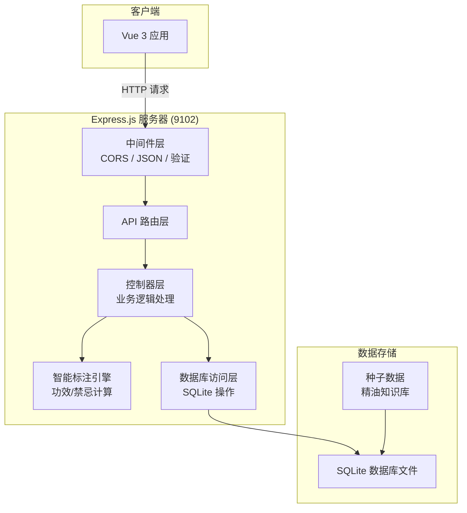
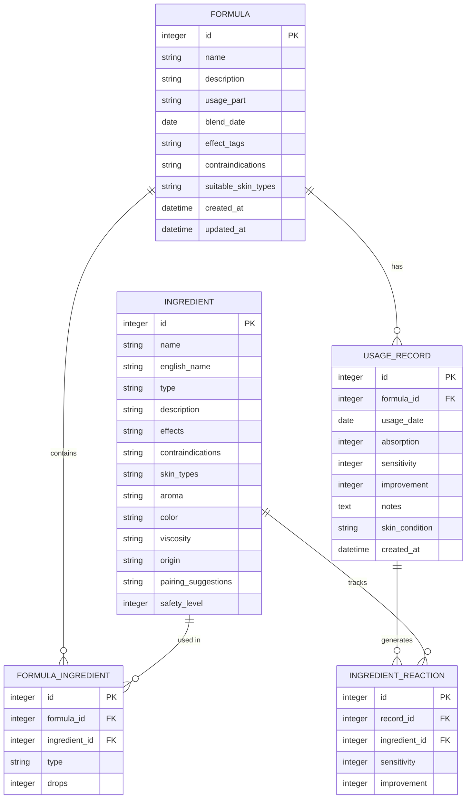

## 1. 架构设计



## 2. 技术栈说明

### 2.1 前端技术栈
- **框架**：Vue 3 (Composition API)
- **构建工具**：Vite 5
- **路由**：Vue Router 4
- **状态管理**：Pinia
- **HTTP 客户端**：Axios
- **图表库**：ECharts 5
- **UI 样式**：Tailwind CSS 3 + 自定义 CSS 变量
- **图标**：Lucide Vue
- **开发端口**：9101

### 2.2 后端技术栈
- **框架**：Express.js 4
- **数据库**：SQLite 3 (better-sqlite3)
- **ORM**：无，原生 SQL 查询
- **中间件**：cors, express.json, express.urlencoded
- **数据验证**：自定义验证中间件
- **开发端口**：9102

### 2.3 数据库选择说明
选择 SQLite 作为数据库的原因：
- 轻量级，无需单独安装数据库服务
- 单文件存储，易于部署和迁移
- 适合单机应用场景，满足个人使用需求
- 足够的数据处理能力支持当前业务规模

## 3. 路由定义

### 3.1 前端路由

| 路由路径 | 页面组件 | 功能说明 |
|----------|----------|----------|
| / | 配方库 | 首页，展示配方列表和创建入口 |
| /formulas | 配方库 | 配方列表、创建、编辑、删除 |
| /formulas/:id | 配方详情 | 配方详情查看和编辑 |
| /ingredients | 成分百科 | 基础油和单方精油浏览 |
| /ingredients/:id | 成分详情 | 成分详细信息展示 |
| /records | 使用记录 | 使用记录时间线和新增记录 |
| /analysis | 肤质分析 | 个人适配档案和肤质趋势 |
| /statistics | 统计页 | 数据统计和可视化图表 |

### 3.2 后端 API 路由

| 方法 | 路由路径 | 功能说明 |
|------|----------|----------|
| GET | /api/formulas | 获取配方列表 |
| GET | /api/formulas/:id | 获取配方详情 |
| POST | /api/formulas | 创建新配方 |
| PUT | /api/formulas/:id | 更新配方 |
| DELETE | /api/formulas/:id | 删除配方 |
| POST | /api/formulas/analyze | 分析配方（自动标注功效和禁忌） |
| GET | /api/ingredients | 获取成分列表（支持类型筛选） |
| GET | /api/ingredients/:id | 获取成分详情 |
| GET | /api/records | 获取使用记录列表 |
| POST | /api/records | 创建使用记录 |
| GET | /api/records/:id | 获取使用记录详情 |
| GET | /api/analysis/profile | 获取个人肤质档案 |
| GET | /api/analysis/trend | 获取肤质趋势数据 |
| GET | /api/statistics/repurchase | 获取配方复购率统计 |
| GET | /api/statistics/fitness | 获取成分适配度排行 |
| GET | /api/statistics/skin-curve | 获取肤质改善曲线数据 |
| GET | /api/statistics/trend | 获取高频使用精油趋势 |

## 4. API 数据模型定义

### 4.1 配方 (Formula)

```typescript
interface Formula {
  id: number;
  name: string;
  description: string;
  baseOils: Array<{
    ingredientId: number;
    name: string;
    drops: number;
  }>;
  essentialOils: Array<{
    ingredientId: number;
    name: string;
    drops: number;
  }>;
  usagePart: string;
  blendDate: string;
  effectTags: string[];
  contraindications: string[];
  suitableSkinTypes: string[];
  createdAt: string;
  updatedAt: string;
}

interface FormulaCreateRequest {
  name: string;
  description?: string;
  baseOils: Array<{ ingredientId: number; drops: number }>;
  essentialOils: Array<{ ingredientId: number; drops: number }>;
  usagePart: string;
  blendDate: string;
}

interface FormulaAnalyzeRequest {
  baseOils: Array<{ ingredientId: number; drops: number }>;
  essentialOils: Array<{ ingredientId: number; drops: number }>;
}

interface FormulaAnalyzeResponse {
  effectTags: string[];
  contraindications: string[];
  suitableSkinTypes: string[];
}
```

### 4.2 成分 (Ingredient)

```typescript
interface Ingredient {
  id: number;
  name: string;
  englishName: string;
  type: 'base' | 'essential';
  description: string;
  effects: string[];
  contraindications: string[];
  skinTypes: string[];
  aroma: string;
  color: string;
  viscosity: string;
  origin: string;
  pairingSuggestions: string[];
  safetyLevel: number;
  createdAt: string;
}
```

### 4.3 使用记录 (UsageRecord)

```typescript
interface UsageRecord {
  id: number;
  formulaId: number;
  formulaName: string;
  usageDate: string;
  absorption: number; // 1-5
  sensitivity: number; // 1-5
  improvement: number; // 1-5
  notes: string;
  skinCondition: string;
  createdAt: string;
}

interface UsageRecordCreateRequest {
  formulaId: number;
  usageDate: string;
  absorption: number;
  sensitivity: number;
  improvement: number;
  notes?: string;
  skinCondition?: string;
}
```

### 4.4 肤质档案 (SkinProfile)

```typescript
interface SkinProfile {
  skinType: string;
  concerns: string[];
  sensitivity: number; // 1-5
  oiliness: number; // 1-5
  dryness: number; // 1-5
  averageAbsorption: number;
  averageImprovement: number;
  totalRecords: number;
  ingredientFitness: Array<{
    ingredientId: number;
    name: string;
    fitnessScore: number;
    usageCount: number;
  }>;
}
```

### 4.5 统计数据

```typescript
interface RepurchaseStats {
  formulaId: number;
  formulaName: string;
  usageCount: number;
  repurchaseRate: number;
}

interface FitnessRanking {
  ingredientId: number;
  name: string;
  type: 'base' | 'essential';
  fitnessScore: number;
  usageCount: number;
  averageSensitivity: number;
}

interface SkinCurveData {
  date: string;
  improvementScore: number;
  sensitivityScore: number;
  absorptionScore: number;
}

interface OilUsageTrend {
  week: string;
  oils: Array<{
    name: string;
    count: number;
  }>;
}
```

## 5. 服务器架构图



## 6. 数据模型

### 6.1 ER 图



### 6.2 DDL 语句

```sql
-- 成分表
CREATE TABLE IF NOT EXISTS ingredients (
    id INTEGER PRIMARY KEY AUTOINCREMENT,
    name TEXT NOT NULL,
    english_name TEXT NOT NULL,
    type TEXT NOT NULL CHECK(type IN ('base', 'essential')),
    description TEXT,
    effects TEXT,
    contraindications TEXT,
    skin_types TEXT,
    aroma TEXT,
    color TEXT,
    viscosity TEXT,
    origin TEXT,
    pairing_suggestions TEXT,
    safety_level INTEGER DEFAULT 1,
    created_at DATETIME DEFAULT CURRENT_TIMESTAMP
);

-- 配方表
CREATE TABLE IF NOT EXISTS formulas (
    id INTEGER PRIMARY KEY AUTOINCREMENT,
    name TEXT NOT NULL,
    description TEXT,
    usage_part TEXT,
    blend_date DATE,
    effect_tags TEXT,
    contraindications TEXT,
    suitable_skin_types TEXT,
    created_at DATETIME DEFAULT CURRENT_TIMESTAMP,
    updated_at DATETIME DEFAULT CURRENT_TIMESTAMP
);

-- 配方-成分关联表
CREATE TABLE IF NOT EXISTS formula_ingredients (
    id INTEGER PRIMARY KEY AUTOINCREMENT,
    formula_id INTEGER NOT NULL,
    ingredient_id INTEGER NOT NULL,
    type TEXT NOT NULL CHECK(type IN ('base', 'essential')),
    drops INTEGER NOT NULL DEFAULT 1,
    FOREIGN KEY (formula_id) REFERENCES formulas(id) ON DELETE CASCADE,
    FOREIGN KEY (ingredient_id) REFERENCES ingredients(id)
);

-- 使用记录表
CREATE TABLE IF NOT EXISTS usage_records (
    id INTEGER PRIMARY KEY AUTOINCREMENT,
    formula_id INTEGER NOT NULL,
    usage_date DATE NOT NULL,
    absorption INTEGER NOT NULL CHECK(absorption BETWEEN 1 AND 5),
    sensitivity INTEGER NOT NULL CHECK(sensitivity BETWEEN 1 AND 5),
    improvement INTEGER NOT NULL CHECK(improvement BETWEEN 1 AND 5),
    notes TEXT,
    skin_condition TEXT,
    created_at DATETIME DEFAULT CURRENT_TIMESTAMP,
    FOREIGN KEY (formula_id) REFERENCES formulas(id) ON DELETE CASCADE
);

-- 成分反应统计表（用于适配度计算）
CREATE TABLE IF NOT EXISTS ingredient_reactions (
    id INTEGER PRIMARY KEY AUTOINCREMENT,
    record_id INTEGER NOT NULL,
    ingredient_id INTEGER NOT NULL,
    sensitivity INTEGER NOT NULL,
    improvement INTEGER NOT NULL,
    FOREIGN KEY (record_id) REFERENCES usage_records(id) ON DELETE CASCADE,
    FOREIGN KEY (ingredient_id) REFERENCES ingredients(id)
);

-- 索引
CREATE INDEX IF NOT EXISTS idx_formula_ingredients_formula ON formula_ingredients(formula_id);
CREATE INDEX IF NOT EXISTS idx_usage_records_formula ON usage_records(formula_id);
CREATE INDEX IF NOT EXISTS idx_usage_records_date ON usage_records(usage_date);
CREATE INDEX IF NOT EXISTS idx_ingredient_reactions_ingredient ON ingredient_reactions(ingredient_id);
```

### 6.3 初始种子数据

系统将预置以下基础数据：

**基础油 (Base Oils)**:
- 甜杏仁油 (Sweet Almond Oil)
- 荷荷巴油 (Jojoba Oil)
- 玫瑰果油 (Rosehip Oil)
- 椰子油 (Coconut Oil)
- 橄榄油 (Olive Oil)
- 葡萄籽油 (Grapeseed Oil)

**单方精油 (Essential Oils)**:
- 薰衣草 (Lavender)
- 茶树 (Tea Tree)
- 玫瑰 (Rose)
- 柠檬 (Lemon)
- 薄荷 (Peppermint)
- 橙花 (Neroli)
- 洋甘菊 (Chamomile)
- 乳香 (Frankincense)
- 依兰依兰 (Ylang Ylang)
- 天竺葵 (Geranium)
