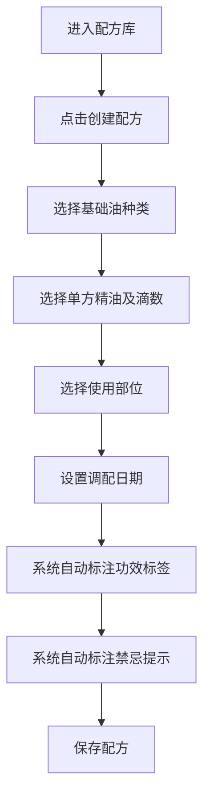
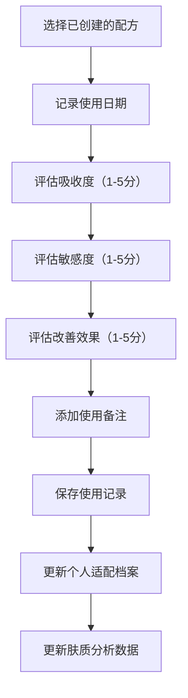

## 1. 产品概述

精油芳疗配方管理与皮肤适配追踪系统，帮助用户创建和管理精油配方，根据精油特性自动标注功效标签和禁忌提示，记录每次使用后的皮肤反应，生成个人适配档案和数据化的肤质改善分析。

- **核心价值**：智能配方管理、皮肤适配追踪、数据驱动的肤质改善
- **目标用户**：精油爱好者、芳疗师、关注皮肤护理的个人用户
- **市场价值**：填补精油配方管理与皮肤反应追踪的一体化解决方案空白

## 2. 核心 Features

### 2.1 用户角色

| 角色 | 注册方式 | 核心权限 |
|------|----------|----------|
| 普通用户 | 默认使用 | 创建配方、记录使用、查看分析和统计 |

### 2.2 Feature 模块

1. **配方库**：配方列表展示、创建新配方、配方详情查看、编辑删除配方
2. **成分百科**：基础油库、单方精油库、成分详情（功效、禁忌、特性）
3. **使用记录**：使用记录列表、新增使用记录（皮肤反应）、历史记录查询
4. **肤质分析**：个人适配档案、皮肤趋势分析、适配度评分
5. **统计页**：配方复购率、成分适配度排行、肤质改善曲线、高频使用精油趋势

### 2.3 Page Details

| 页面名称 | 模块名称 | Feature Description |
|----------|----------|---------------------|
| 配方库 | 配方列表 | 卡片式展示所有配方，显示名称、功效标签、创建日期 |
| 配方库 | 创建配方 | 选择基础油和单方精油、设置滴数比例、选择使用部位、调配日期 |
| 配方库 | 智能标注 | 根据所选精油自动计算功效标签、禁忌提示、适配肤质 |
| 成分百科 | 分类浏览 | 基础油/单方精油分类切换、搜索过滤 |
| 成分百科 | 成分详情 | 展示成分特性、功效、禁忌、搭配建议 |
| 使用记录 | 记录列表 | 时间线展示使用记录，关联对应配方 |
| 使用记录 | 新增记录 | 记录吸收度、敏感度、改善效果、备注信息 |
| 肤质分析 | 适配档案 | 个人皮肤类型、历史反应汇总、成分适配度 |
| 肤质分析 | 趋势分析 | 肤质变化趋势图表、改善效果评分 |
| 统计页 | 复购率统计 | 各配方重复使用率排名 |
| 统计页 | 适配度排行 | 成分与个人皮肤的适配度排名 |
| 统计页 | 肤质曲线 | 肤质改善数据可视化曲线图 |
| 统计页 | 趋势分析 | 高频使用精油的时间趋势图表 |

## 3. 核心流程

### 3.1 用户创建配方流程

### 3.2 记录使用流程

## 4. 用户界面设计

### 4.1 设计风格

**自然治愈系美学**：
- **主色调**：柔和鼠尾草绿 `#7BA17B`（代表自然、疗愈）
- **辅助色**：薰衣草紫 `#B8A9C9`（代表舒缓、放松）、暖杏色 `#F5D0A9`（代表温暖、滋养）
- **背景色**：米白色 `#FAF8F5`（营造干净舒适的氛围）
- **文字色**：深墨绿 `#2D3A2D`（优雅易读）

**设计元素**：
- **按钮风格**：圆角矩形（12px），微立体阴影，悬停时轻微放大
- **卡片风格**：柔和圆角（16px），浅色边框，精致投影
- **图标风格**：线性简约图标，搭配自然元素（叶片、水滴、花朵）
- **字体**：标题使用优雅衬线字体，正文使用简洁无衬线字体

### 4.2 Page Design Overview

| 页面名称 | 模块名称 | UI Elements |
|----------|----------|-------------|
| 配方库 | 配方列表 | 网格布局卡片，标签式筛选，渐变背景卡片 |
| 配方库 | 创建表单 | 分步表单，选择器带预览，精油标签自动生成 |
| 成分百科 | 列表 | 双栏布局，左侧分类导航，右侧卡片列表 |
| 成分百科 | 详情 | 大图展示，特性标签矩阵，禁忌提示醒目 |
| 使用记录 | 时间线 | 垂直时间线布局，关联配方卡片，评分星星展示 |
| 肤质分析 | 档案 | 头像区域，数据卡片网格，雷达图展示适配度 |
| 统计页 | 图表区 | 卡片式图表布局，多种图表类型（折线、柱状、饼图） |

### 4.3 响应式设计

- **桌面优先**：1280px以上为最佳体验，采用多列网格布局
- **平板适配**：768px-1280px，自动调整为双列布局
- **移动适配**：768px以下，单列布局，底部导航栏，优化触控区域

### 4.4 动效设计

- **页面加载**：淡入效果，卡片依次上滑入场（staggered animation）
- **悬停效果**：卡片轻微上浮，阴影加深，按钮背景色渐变过渡
- **数据更新**：数字滚动动画，图表曲线绘制动画
- **表单交互**：错误提示抖动动画，成功提交绿色对勾动画
